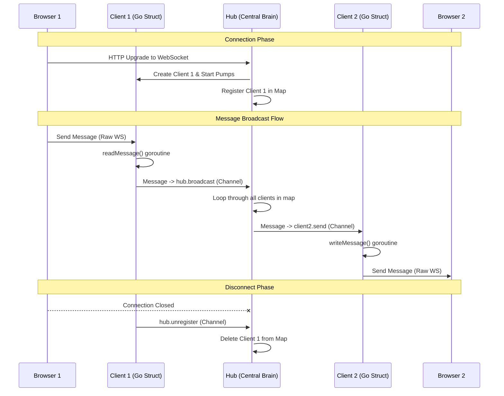

# Gosync Architecture

This diagram illustrates how a message flows from one browser through the Go backend to all other connected clients.

## Component Breakdown

1.  **Server (`server.go`)**: The entry point. It upgrades standard HTTP requests into WebSocket connections and initializes a `Client`.
2.  **Hub (`hub.go`)**: The central dispatcher. It runs in its own goroutine and manages the state of all active connections using channels.
3.  **Client (`client.go`)**: The bridge. Every connection has its own `Client` struct with two dedicated goroutines:
    *   `readMessage`: Pulls data from the network and pushes it to the Hub.
    *   `writeMessage`: Pulls data from the Hub and pushes it to the network.
4.  **Channels**: The glue. We use Go channels (`register`, `unregister`, `broadcast`, and `send`) to ensure thread-safe communication between components without complex locking.
